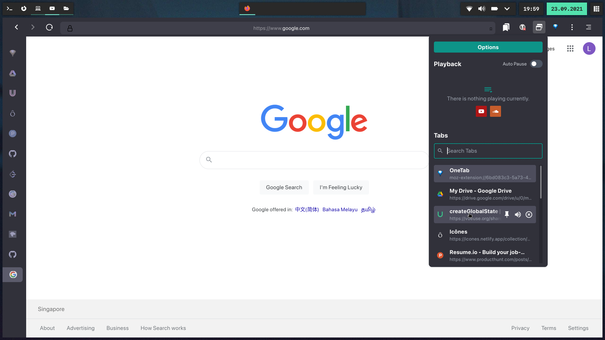

# Multi Tool Extension

> Browser extension to search through tabs and control media playback
> from sites like youtube and soundcloud and other features stitched together.
>
> Other minor QOL features:
>
> - Clears cookies when visiting medium blogs
> - Context menu to copy selected text to a notion page.
>
> Made using [antfu/vitesse-webext](https://github.com/antfu/vitesse-webext) template

Use `Ctrl+\` to cycle through all the pinned tabs
